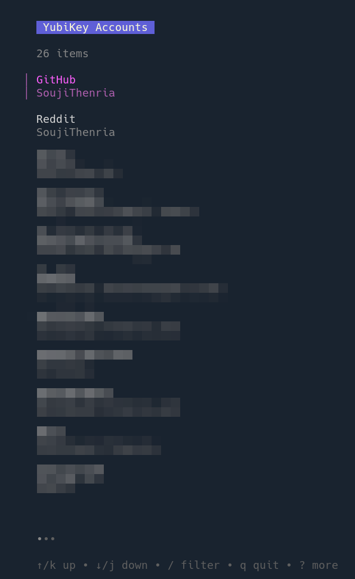
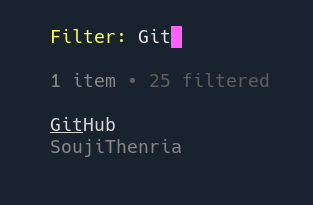
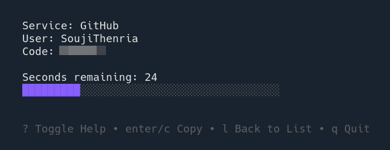

# YKO

YKO is a terminal user interface for generating OATH codes for accounts stored
on a YubiKey.

## Images
List all OATH accounts on the YubiKey:

Search through all accounts:

Generate the code for one account:

## Build
You can run `make` or `go build` from inside the project's root directory.
